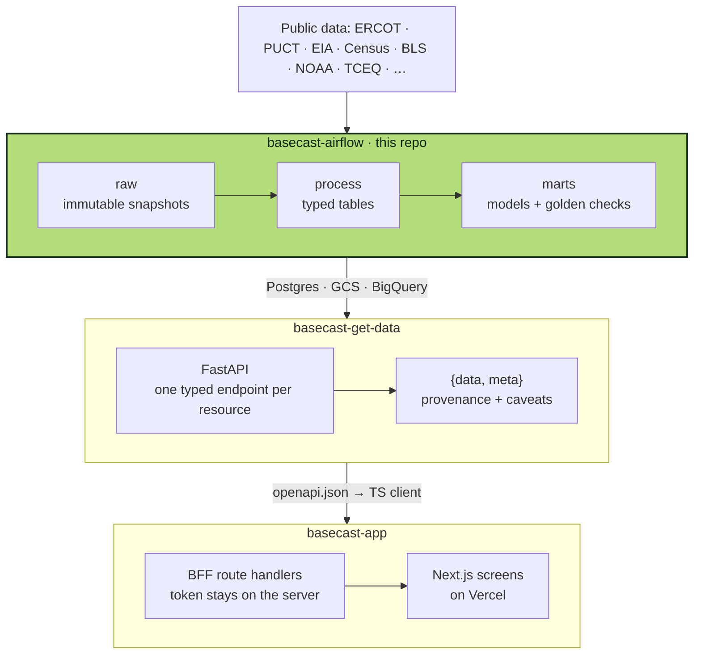
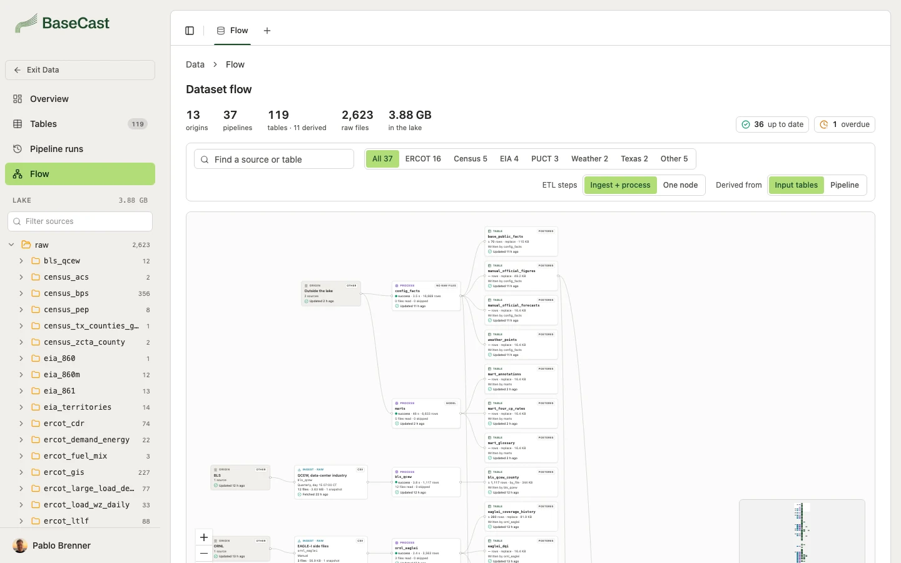

<div align="center">

<picture>
  <source media="(prefers-color-scheme: dark)" srcset="docs/assets/logo-dark.svg">
  
</picture>

### airflow

**Texas' public grid data in an immutable lake, typed tables and the models behind every BaseCast forecast.**

[](https://github.com/brennerpablo/basecast-airflow/actions/workflows/deploy.yml)

<br>


</div>

<table>
  <tr>
    <td align="center" width="20%"><h3>35</h3>sources</td>
    <td align="center" width="20%"><h3>119</h3>tables</td>
    <td align="center" width="20%"><h3>2,623</h3>raw files</td>
    <td align="center" width="20%"><h3>3.88 GB</h3>in the lake</td>
    <td align="center" width="20%"><h3>31</h3>marts served</td>
  </tr>
</table>
<p align="center"><sub>As of Sep 26, 2026</sub></p>

## How it fits



| Stage | What it does | Where it writes |
|---|---|---|
| **raw** | Finds and downloads the files of ERCOT, PUCT, EIA, Census, BLS, NOAA, Open-Meteo, TCEQ, the Texas Comptroller and others, as published | `raw/source=<id>/dt=<snapshot>/`, one `_manifest.json` per folder (URL, sha256) |
| **process** | Parses them into typed tables; reprocessing never duplicates | Postgres for what the API reads; Parquet in the lake + BigQuery for the large series |
| **marts** | Builds the models and the small tables the API serves; a mart whose golden check fails is not written | `public.mart_*` + `mart_meta` |

Every run leaves one `etl_run` row (status, duration, events). Airflow runs it all on a GCP VM: one thin DAG per
source that only calls the source's `run()`, built by a factory.

<p align="center">
  
  <br><sub>The lineage as basecast-app's <code>/data/flow</code> draws it: origin → ingest → process → tables → derived</sub>
</p>

## Quickstart

```bash
uv sync                                      # Python 3.12 + pinned dependencies
uv run basecast sources                      # source ids, in runbook order
uv run basecast run ercot_gis                # download new or changed files into the lake
uv run basecast process ercot_gis --dry-run  # parse, print schema and a sample, write nothing
```

No credentials are needed for the raw stage. `cp .env.example .env` for the rest.

<details>
<summary><b>More commands</b></summary>

```bash
uv run basecast run ercot_gis --dry-run          # list what would be downloaded
uv run basecast datasets                         # every dataset, its target and write mode
uv run basecast process ercot_gis                # parse new raw files into the tables
uv run basecast process ercot_gis --reprocess    # re-parse everything (add --rebuild after schema changes)
uv run basecast runs                             # recent etl_run rows (local Parquet)
uv run basecast audit                            # raw integrity: manifests, sha256, file signatures
uv run pytest                                    # tests (offline, small real fixtures)
```

The marts need the `analysis` group:

```bash
uv run --group analysis basecast marts list                                     # marts in build order
uv run --group analysis basecast marts build --all --as-of 2026-09-26 --dry-run # Parquet to data/marts_dry/
uv run --group analysis basecast marts build --all                              # write Postgres
uv run --group analysis basecast marts check                                    # re-run the checks on Postgres
uv run --group analysis basecast export-geo                                     # county / weather-zone GeoJSON for the app
```

A real build writes only from committed code: run it from a clean checkout of HEAD with `BASECAST_GIT_SHA` set
(or `--allow-dirty` for a scratch database). When a golden check fails, the previous version keeps being served
and the `etl_run` row (source `marts`, stage `model`) ends `partial`.

</details>

<details>
<summary><b>Environment</b></summary>

| Variable | Default | What |
|---|---|---|
| `STORAGE_ROOT` | `file://./data` | Lake root: `file://...` locally, `gs://basecast-509812-lake` on the VM |
| `BASECAST_DB_URL` | unset | Postgres `basecast` database (processed tables, `etl_run`, `lake_processed`); needed to process |
| `GCP_PROJECT` | unset | Needed for the BigQuery datasets and Gemini |
| `BQ_DATASET` / `BQ_LOCATION` | `basecast` / `us-central1` | BigQuery destination |
| `GEMINI_MODEL` | `gemini-3.8-flash` | Chart values and image-only pages of documents (Vertex AI, location `global`) |
| `BASECAST_USER_AGENT` | project UA | HTTP User-Agent |

</details>

<details>
<summary><b>Airflow</b></summary>

- `dags/dag_<source>_incremental.py`: one per source, scheduled (cadences in `dags/basecast_dags/config.py`),
  `fetch_raw` then `process`.
- `dag_config_facts_incremental`: loads the YAML files in `config/`.
- `dag_source_full`: manual backfill or reprocessing (params: source, stages, window, options).

Deployment (VM, Cloud SQL, bucket, BigQuery, pools) is in [deploy/gcp/README.md](deploy/gcp/README.md). A push
to `main` redeploys the VM and restarts the scheduler. The DagBag test needs Airflow installed (it skips
otherwise).

</details>

## Docs

- [docs/SCRAPING_RUNBOOK.md](docs/SCRAPING_RUNBOOK.md): what to download, from where, and what each source produces
- [docs/processing.md](docs/processing.md): raw → typed tables (the parser contract, write modes)
- [catalog.yaml](catalog.yaml) and [docs/ercot-data-catalog.md](docs/ercot-data-catalog.md): the source catalog, with verification status
- [docs/decisions.md](docs/decisions.md): decision log · [docs/KICKOFF.md](docs/KICKOFF.md): project kickoff (Portuguese)

<div align="center">
<sub>
<b>basecast-airflow</b> ·
<a href="https://github.com/brennerpablo/basecast-get-data">basecast-get-data</a> ·
<a href="https://github.com/brennerpablo/basecast-app">basecast-app</a>
</sub>
</div>
